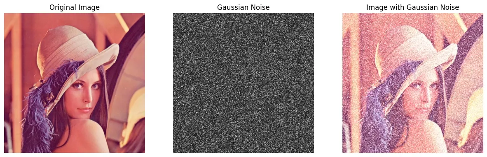

# Image Noise Theory and Gaussian Noise

## 1. Image Noise in Digital Images

In digital image processing, **image noise** refers to unwanted random variations in pixel intensity values that degrade the quality of an image. These variations cause the image to deviate from the true visual information of the original scene, often reducing clarity, distorting edges, and obscuring fine details.

Image noise is an inherent problem in digital imaging systems and can be introduced during several stages, including image acquisition, transmission, and processing. Common sources include electronic sensor imperfections, environmental interference, and signal amplification processes.

Noise negatively affects both human visual perception and automated image analysis tasks such as segmentation, edge detection, feature extraction, and object recognition. As a result, understanding the nature and behavior of image noise is fundamental to effective image processing.

---

## 2. Sources of Image Noise

Image noise may arise from multiple factors, including:

- **Sensor limitations:** Imperfections in camera sensors lead to random fluctuations in pixel intensity.
- **Low-light conditions:** Higher amplification increases electronic noise.
- **Thermal noise:** Heat generated in electronic components affects signal accuracy.
- **Transmission errors:** Noise introduced during image transfer or communication.
- **Quantization errors:** Approximation errors during analog-to-digital conversion.

Since many of these factors are unavoidable in practical systems, noise modeling is essential for designing effective noise reduction techniques.

---

## 3. Overview of Common Noise Types

Several noise models are used in digital image processing depending on the noise source and characteristics. Common types include:

- **Salt-and-pepper noise**, which appears as random black and white pixels.
- **Poisson noise**, caused by photon counting in low-light imaging.
- **Speckle noise**, commonly observed in radar and medical imaging.
- **Gaussian noise**, which follows a normal probability distribution.

This project focuses specifically on **Gaussian noise**, as it is one of the most widely used noise models and closely represents noise encountered in many real-world imaging systems.

---

## 4. Gaussian Noise

Gaussian noise is a type of **statistical noise** in which the intensity variations added to an image follow a **normal (Gaussian) distribution**. It typically affects all pixels in the image, with noise values drawn independently from a normal distribution. This distribution indicates that small noise values occur more frequently than large deviations, resulting in the characteristic bell-shaped curve.

The Gaussian distribution indicates that most noise values are concentrated near the mean (μ), while large deviations are increasingly rare. Approximately 68% of noise values lie within one standard deviation of the mean, 95% within two standard deviations, and 99.7% within three. This explains why Gaussian noise introduces mostly small intensity variations across the image.

**Gaussian noise commonly originates from:**
- Thermal noise in electronic circuits
- Sensor readout errors
- Signal amplification processes

Gaussian noise is typically modeled as **additive noise**, meaning it is added directly to the original image signal rather than replacing pixel values.

The probability density function (PDF) of Gaussian noise is given by:
\[
p(z) = \frac{1}{\sqrt{2\pi\sigma^2}} 
\exp\left( -\frac{(z-\mu)^2}{2\sigma^2} \right)
\]

where:
- \( \mu \) is the mean
- \( \sigma^2 \) is the variance
- \( \sigma \) is the standard deviation
- \( z \) represents noise intensity value
  The probability density function (PDF) describes how likely different noise intensity values are. 
It determines the distribution of noise values added to image pixels, ensuring that small deviations from the mean occur more frequently than large deviations. 
---

## 5. Characteristics of Gaussian Noise

Gaussian noise exhibits several key properties:

- **Additive nature:** Noise values are added to the original pixel values.
- **Random distribution:** Noise values vary randomly across the image.
- **Statistical independence:** Noise at one pixel is independent of noise at other pixels.
- **Zero mean (commonly assumed):** Noise fluctuates around zero, causing no systematic brightness shift.
- **Variance-controlled strength:** The variance determines the intensity of the noise.

A noisy image can be mathematically represented as:

\[
I_{noisy}(x, y) = I(x, y) + N(x, y)
\]

where:
- \( I(x, y) \) is the original image,
- \( N(x, y) \) represents Gaussian noise,
- \( I_{noisy}(x, y) \) is the resulting noisy image.

---
## 6. Importance of Gaussian Noise in Image Processing

Gaussian noise is widely studied and used in image processing because:

- It closely approximates noise generated by many real imaging systems.
- It provides a strong theoretical and statistical foundation.
- Many classical denoising techniques are specifically designed to handle Gaussian noise.

Understanding Gaussian noise is therefore essential for evaluating noise removal methods such as **Gaussian filtering** and **Median filtering**, which are implemented and analyzed later in this project.

---

